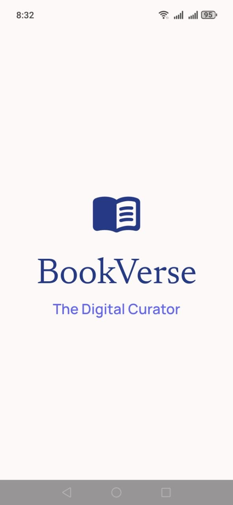
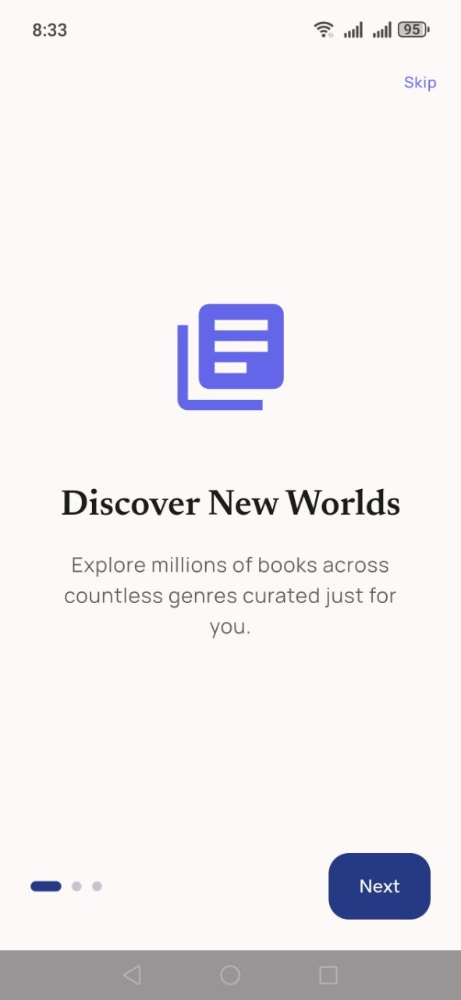
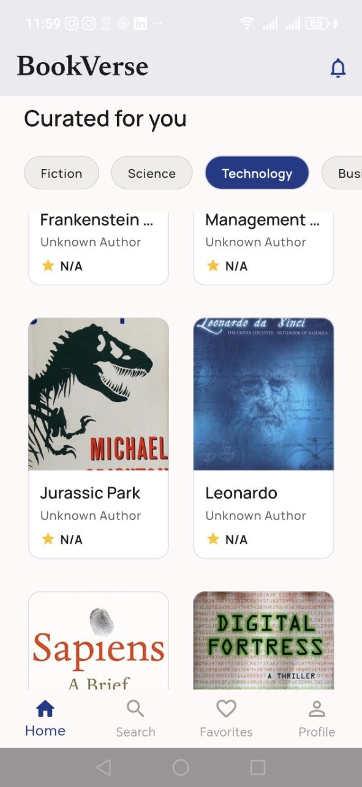
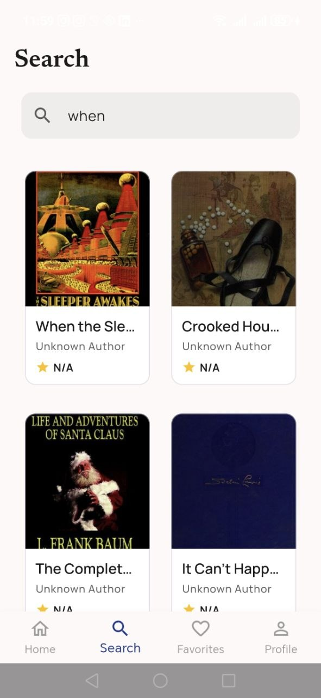
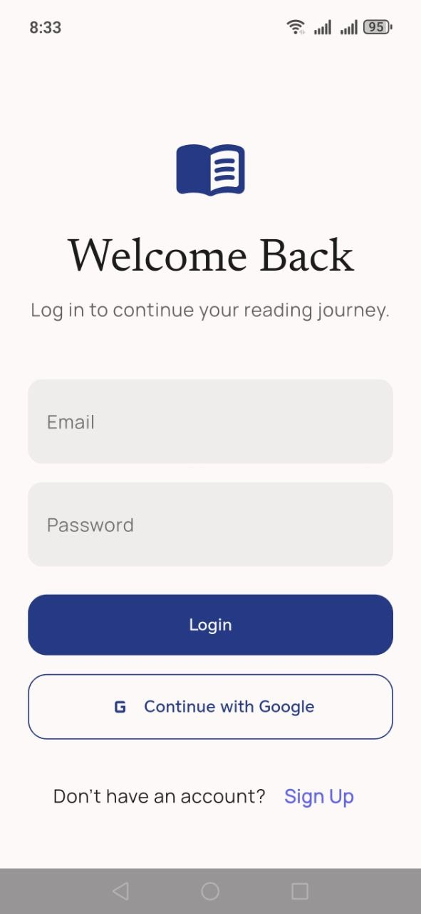

# 📚 BookVerse App

BookVerse is a modern Flutter application that allows users to discover, search, and explore books with detailed information in a clean and user-friendly interface.

The app integrates with book APIs to provide real-time data, including book titles, authors, descriptions, and cover images.

---

## ✨ Features

- 📖 Browse popular books
- 🔍 Search books by title or keyword
- 📚 View detailed book information
- 🖼️ Display book cover images
- ⭐ Save favorite books
- 🌙 Dark mode and Light mode support
- 📱 Responsive and modern UI design
- ⚡ Fast and smooth performance

---

## 🛠️ Technologies Used

- **Flutter**
- **Dart**
- **REST API Integration**
- **JSON Parsing**
- **HTTP Package**
- **State Management**
- **Material UI**

---
## 📸 Screenshots

### 📚 Splash Screen

### 📚 Introduction Screen

### 📚 Home Screen

### 🔍 Search Screen

### 📖 Book Details

### ❤️ Favorites Screen

### 📖 Login Screen

### ❤️ Profile Screen

